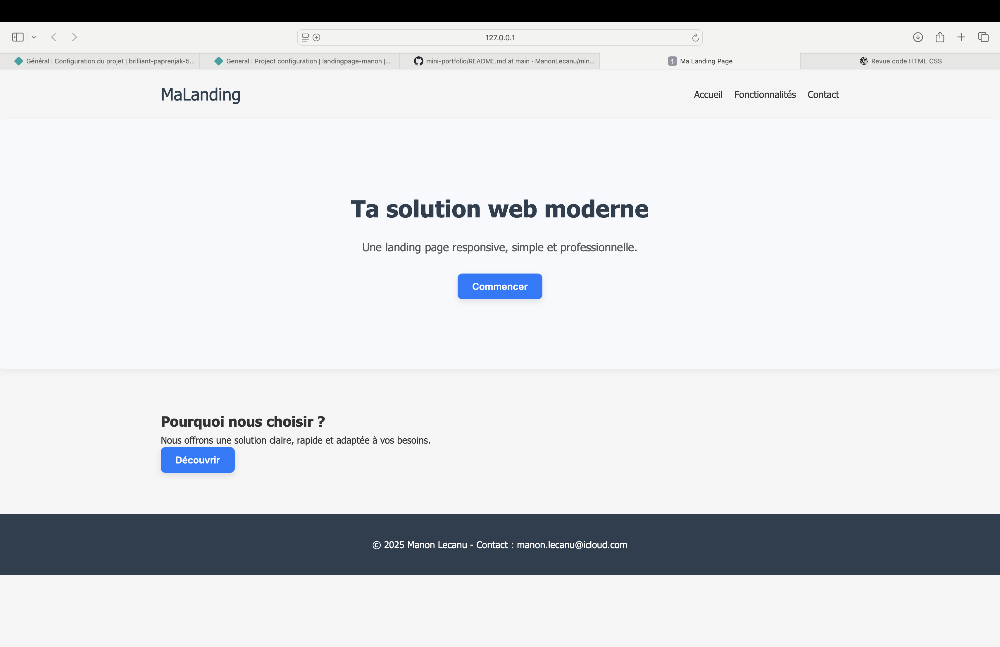

# Landing Page Web Moderne

Une landing page responsive, moderne et professionnelle.  
**Objectif :** mettre en avant mes compétences en **HTML** & **CSS**, et apprendre à concevoir une page d’accueil engageante.

---

## 🖥️ Démo

[🔗 Voir le site en ligne](https://landingpage-manon.netlify.app)

---

## 📸 Aperçu

---

## 🛠️ Technologies utilisées

---

## ✨ Fonctionnalités

- ✅ Design **moderne**, clair et **responsive** sur mobile et desktop
- ✅ **Typographie Inter** pour une cohérence visuelle élégante
- ✅ **Boutons stylisés** avec effets hover et animations légères
- ✅ **Structure HTML sémantique** : header, sections, footer
- ✅ **Code bien organisé** et facilement personnalisable
- ✅ Déploiement facile avec **Netlify**

---

## 📁 Structure du projet

landing-page/
├── index.html
├── style.css
├── images/
│ └── screenshot.png
└── README.md

---

## 🔗 Liens utiles

- [Lien Netlify du site](https://landingpage-manon.netlify.app)

---

## 📌 Statut du projet

# Landing Page Web Moderne

Une landing page responsive, moderne et professionnelle.  
**Objectif :** mettre en avant mes compétences en **HTML** & **CSS**, et apprendre à concevoir une page d’accueil engageante.

---

## 🖥️ Démo

[🔗 Voir le site en ligne](https://landingpage-manon.netlify.app)

---

## 📸 Aperçu

---

## 🛠️ Technologies utilisées

---

## ✨ Fonctionnalités

- ✅ Design **moderne**, clair et **responsive** sur mobile et desktop
- ✅ **Typographie Inter** pour une cohérence visuelle élégante
- ✅ **Boutons stylisés** avec effets hover et animations légères
- ✅ **Structure HTML sémantique** : header, sections, footer
- ✅ **Code bien organisé** et facilement personnalisable
- ✅ Déploiement facile avec **Netlify**

---

## 📁 Structure du projet

landing-page/
├── index.html
├── style.css
├── images/
│ └── screenshot.png
└── README.md

---

## 🔗 Liens utiles

- [Lien Netlify du site](https://landingpage-manon.netlify.app)

---

## 📌 Statut du projet

